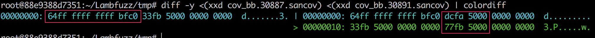

## 0x01 honggfuzz

[官网](http://honggfuzz.com/)

看一下泉哥关于honggfuzz的[文章](http://riusksk.me/tags/honggfuzz/)

1. [honggfuzz漏洞挖掘技术深究系列（1）——反馈驱动（Feedback-Driven](http://riusksk.me/2018/07/29/honggfuzz%E6%BC%8F%E6%B4%9E%E6%8C%96%E6%8E%98%E6%8A%80%E6%9C%AF1/)

    计算代码覆盖率计量单位，通常有3种：
        1. 函数（Fuction-Level） 
        2. 基本块（BasicBlock-Level） 
        3. 边界（Edge-Level）:A->B->C与A->C两种路径，不能判断曾经是否有从A直接到C，所以在AC之间增加虚拟块D，判断D是否被覆盖来断定是否经过AC路径  

        A                A
        |\               |\
        | B   ======>    D B
        |/               |/
        C                C


    代码覆盖率有两种情况：  

        1. 有源码  
            
        ```c
        #include <stdio.h>
        __attribute__((noinline))
        void foo() { printf("foo\n"); }

        int main(int argc, char **argv) {
        if (argc == 2)
            foo();
        printf("main\n");
        }
        ```

        `clang++ -g cov.cc -fsanitize=address -fsanitize-coverage=bb -o cov_bb`

        > ASAN_OPTIONS=coverage=1 ./cov_bb  
        > ASAN_OPTIONS=coverage=1 ./cov_bb foo

        

        0xC0BFFFFFFFFFFF64或者0xC0BFFFFFFFFFFF32是magic number，后边是基本块的地址。

        $LLVM/projects/compiler-rt/lib/sanitizer_common/scripts/sancov.py可以打印sancov文件的信息

        > ./sancov.py print cov_bb.30887.sancov cov_bb.30891.sancov
        > ./sancov.py: read 1 64-bit PCs from cov_bb.30887.sancov
        > ./sancov.py: read 3 64-bit PCs from cov_bb.30891.sancov
        > ./sancov.py: 2 files merged; 3 PCs total
        > 0x50fadc
        > 0x50fb33
        > 0x50fb77


        2. 无源码  
        
        用Pin、DynamoRIO等二进制插桩工具

    `-fsanitize=address -fsanitize-coverage=bb`编译后，`ASAN_OPTIONS=coverage=1:coverage_direct=1 `执行一下，会生成两个文件:  
    1. sancov.map记录是模块信息  
    2. sancov.raw记录着执行过的基本块地址信息

    之后的分析在新版的honggfuzz中没有相应源码，但是泉哥自己的[仓库](https://github.com/riusksk/riufuzz)里有他分析的代码

    自己是不可能分析代码的了，这辈子也不可能分析代码了～～～


[SanitizerCoverage](https://bcain-llvm.readthedocs.io/projects/clang/en/release_40/SanitizerCoverage/)


2. [honggfuzz漏洞挖掘技术深究系列（2）—— Persistent Fuzzing](http://riusksk.me/2018/08/22/honggfuzz%E6%BC%8F%E6%B4%9E%E6%8C%96%E6%8E%98%E6%8A%80%E6%9C%AF2/)

硬件方式:基于Intel BTS (Branch Trace Store) 或Intel PT (Processor Tracing) 去计算代码覆盖  

```c
int LLVMFuzzerTestOneInput(uint8_t *buf, size_t len) {
	TestAPI(buf, len);
	return 0;
}
```

使用`-fsanitize-coverage=trace-pc,indirect-calls,trace-cmp`选项编译一下。

trace-pc: 追踪执行过的基本块BB，在每个edge中插入`__saitizer_cov_trace_pc()`函数，可定义该函数作为相应的回调处理  
indirect-calls:在每个间接调用中添加PC追踪，与前面的trace-pc或trace-pc-guard联合使用，回调函数：`__sanitizer_cov_trace_pc_indir`  
trace-cmp:追踪每个比较指令和swith语句  

在instrument.c中有对回调函数的的定义  

```c
/*
 * -fsanitize-coverage=trace-pc
 */
ATTRIBUTE_X86_REQUIRE_SSE42 void __sanitizer_cov_trace_pc(void) {
    register uintptr_t ret = (uintptr_t)__builtin_return_address(0) & _HF_PERF_BITMAP_BITSZ_MASK;
    register uint8_t prev = ATOMIC_BTS(feedback->bbMapPc, ret);
    if (!prev) {
        ATOMIC_PRE_INC_RELAXED(feedback->pidFeedbackPc[my_thread_no]);
    }
}
```

presistent.c中对持续化fuzz的代码：

```c
static void HonggfuzzPersistentLoop(void) {
    for (;;) {
        size_t len;
        const uint8_t* buf;

        HonggfuzzFetchData(&buf, &len);
        HonggfuzzRunOneInput(buf, len);
    }
}
```

如果发现新路径，添加新样本到队列后继续fuzzing  

```c
/* Any increase in coverage (edge, pc, cmp, hw) counters forces adding input to the corpus */
if (run->linux.hwCnts.newBBCnt > 0 || softCntPc > 0 || softCntEdge > 0 || softCntCmp > 0 ||
    diff0 < 0 || diff1 < 0) {
    if (diff0 < 0) {
        run->global->linux.hwCnts.cpuInstrCnt = run->linux.hwCnts.cpuInstrCnt;
    }
    if (diff1 < 0) {
        run->global->linux.hwCnts.cpuBranchCnt = run->linux.hwCnts.cpuBranchCnt;
    }
    run->global->linux.hwCnts.bbCnt += run->linux.hwCnts.newBBCnt;
    run->global->linux.hwCnts.softCntPc += softCntPc;
    run->global->linux.hwCnts.softCntEdge += softCntEdge;
    run->global->linux.hwCnts.softCntCmp += softCntCmp;
    LOG_I("Size:%zu (i,b,hw,edge,ip,cmp): %" PRIu64 "/%" PRIu64 "/%" PRIu64 "/%" PRIu64
          "/%" PRIu64 "/%" PRIu64 ", Tot:%" PRIu64 "/%" PRIu64 "/%" PRIu64 "/%" PRIu64
          "/%" PRIu64 "/%" PRIu64,
        run->dynamicFileSz, run->linux.hwCnts.cpuInstrCnt, run->linux.hwCnts.cpuBranchCnt,
        run->linux.hwCnts.newBBCnt, softCntEdge, softCntPc, softCntCmp,
        run->global->linux.hwCnts.cpuInstrCnt, run->global->linux.hwCnts.cpuBranchCnt,
        run->global->linux.hwCnts.bbCnt, run->global->linux.hwCnts.softCntEdge,
        run->global->linux.hwCnts.softCntPc, run->global->linux.hwCnts.softCntCmp);
    fuzz_addFileToFileQ(run->global, run->dynamicFile, run->dynamicFileSz);
```

3. [honggfuzz漏洞挖掘技术深究系列（3）——Fuzz策略](http://riusksk.me/2018/09/16/honggfuzz3/)

mangle.c中保存变异策略，`mangle_mangleContent`掌管整个变异过程。  

```c
void mangle_mangleContent(run_t* run) {
    if (run->mutationsPerRun == 0U) {
        return;
    }

    /* No point in modifying it, if its size is 0 */
    if (run->dynamicFileSz == 0UL) {
        input_setSize(run, 1UL);
    }

    /* Max number of stacked changes is 6 */
    uint64_t changesCnt = util_rndGet(1, run->global->mutate.mutationsPerRun);

    for (uint64_t x = 0; x < changesCnt; x++) {
        uint64_t choice = util_rndGet(0, ARRAYSIZE(mangleFuncs) - 1);
        mangleFuncs[choice](run);
    }
}
```

如果变异率为0，则只打开，适合于验证操作。  
文件大小为0，则写入一字节。  
否则，随机选择变异函数进行变异，函数列表如下：  

> mangle_Resize,
> mangle_Byte,
> mangle_Bit,
> mangle_Bytes,
> mangle_Magic,
> mangle_IncByte,
> mangle_DecByte,
> mangle_NegByte,
> mangle_AddSub,
> mangle_Dictionary,
> mangle_DictionaryInsert,
> mangle_MemMove,
> mangle_MemSet,
> mangle_Random,
> mangle_CloneByte,
> mangle_Expand,
> mangle_Shrink,
> mangle_InsertRnd,
> mangle_ASCIIVal,
> mangle_InsertZero,

[radamsa](https://gitlab.com/akihe/radamsa)，a general-purpose fuzzer。  

- `mangle_Resize`变异，使用`util_rndGet`函数获取随机位置，`input_setSize`填充那部分。为什么要填空格？  

```c
static void mangle_Resize(run_t* run) {
    size_t sz = util_rndGet(1, run->global->mutate.maxFileSz);
    input_setSize(run, sz);
}
uint64_t util_rndGet(uint64_t min, uint64_t max) {
    if (min > max) {
        LOG_F("min:%" PRIu64 " > max:%" PRIu64, min, max);
    }

    if (max == UINT64_MAX) {
        return util_rnd64();
    }

    return ((util_rnd64() % (max - min + 1)) + min);
}
void input_setSize(run_t* run, size_t sz) {
    if (sz > run->global->mutate.maxFileSz) {
        PLOG_F("Too large size requested: %zu > maxSize: %zu", sz, run->global->mutate.maxFileSz);
    }
    size_t old_sz = run->dynamicFileSz;
    run->dynamicFileSz = sz;
    if (run->global->cfg.only_printable && old_sz < sz) {
        memset(run->dynamicFile, ' ', sz - old_sz);
    }
}
```
- `mangle_Byte`，对随机位置设置uint8_t类型的数据  
```c
run->dynamicFile[off] = (uint8_t)util_rnd64();
```

- `mangle_Bit`，对随机位进行位翻转  
```c  
run->dynamicFile[off] ^= (uint8_t)(1U << util_rndGet(0, 7));
```

- `mangle_Bytes`使用`mangle_Overwrite`对随机位置的随机个字节重写。  

```c
static void mangle_Bytes(run_t* run) {
    size_t off = util_rndGet(0, run->dynamicFileSz - 1);
    uint32_t val = (uint32_t)util_rnd64();

    /* Overwrite with random 2,3,4-byte values */
    size_t toCopy = util_rndGet(2, 4);
    mangle_Overwrite(run, (uint8_t*)&val, off, toCopy);
}
```

- `mangle_Magic`说是取各种边界值进行覆写，*咩明白*，看着只是用特定的数据覆盖一下，还有一个改字节为可打印的操作。  

```c
static void mangle_Magic(run_t* run) {
    static const struct {
        const uint8_t val[8];
        const size_t size;
    } mangleMagicVals[] = {
        /* 1B - No endianness */
        {"\x00\x00\x00\x00\x00\x00\x00\x00", 1},
        {"\x01\x00\x00\x00\x00\x00\x00\x00", 1},
        {"\x02\x00\x00\x00\x00\x00\x00\x00", 1},
        {"\x03\x00\x00\x00\x00\x00\x00\x00", 1},
    }
    size_t off = util_rndGet(0, run->dynamicFileSz - 1);
    uint64_t choice = util_rndGet(0, ARRAYSIZE(mangleMagicVals) - 1);
    mangle_Overwrite(run, mangleMagicVals[choice].val, off, mangleMagicVals[choice].size);
    util_turnToPrintable(&run->dynamicFile[off], mangleMagicVals[choice].size);
}
```

- `mangle_IncByte`、`mangle_DecByte`、`mangle_NegByte`对随机位置数据加一、减一、取反。  
```c
    run->dynamicFile[off] += (uint8_t)1UL;
    run->dynamicFile[off] -= (uint8_t)1UL;
    run->dynamicFile[off] = ~(run->dynamicFile[off]);
```

- `mangle_AddSub`，取随机位置的1、2、4或8字节的数据长度，`mangle_AddSubWithRange`对相应长度的字节进行加减操作  

```c
static void mangle_AddSub(run_t* run) {
    size_t off = util_rndGet(0, run->dynamicFileSz - 1);

    /* 1,2,4,8 */
    uint64_t varLen = 1U << util_rndGet(0, 3);
    if ((run->dynamicFileSz - off) < varLen) {
        varLen = 1;
    }

    mangle_AddSubWithRange(run, off, varLen);
}

static void mangle_AddSubWithRange(run_t* run, size_t off, uint64_t varLen) {
    ...
    case 8: {
        int64_t val;
        memcpy(&val, &run->dynamicFile[off], sizeof(val));
        if (util_rnd64() & 0x1) {
            val += delta;
        } else {
            /* Foreign endianess */
            val = __builtin_bswap64(val);
            val += delta;
            val = __builtin_bswap64(val);
        }
        mangle_Overwrite(run, (uint8_t*)&val, off, varLen);
    }
    ...
}
```

- `mangle_Dictionary`变异目录名？？？为什么？？？通过`mangle_DictionaryNoCheck`，随机取文件夹名字进行变异。*不懂*  

```c
static void mangle_Dictionary(run_t* run) {
    if (run->global->mutate.dictionaryCnt == 0) {
        mangle_Bit(run);
        return;
    }

    mangle_DictionaryNoCheck(run);
}

static void mangle_DictionaryNoCheck(run_t* run) {
    size_t off = util_rndGet(0, run->dynamicFileSz - 1);

    uint64_t choice = util_rndGet(0, run->global->mutate.dictionaryCnt - 1);
    struct strings_t* str = TAILQ_FIRST(&run->global->mutate.dictq);
    for (uint64_t i = 0; i < choice; i++) {
        str = TAILQ_NEXT(str, pointers);
    }

    mangle_Overwrite(run, (uint8_t*)str->s, off, str->len);
}

```

- `mangle_DictionaryInsert`和`mangle_Dictionary`类似，`mangle_DictionaryInsertNoCheck`在目录的随机位置中插入随机数据  

```c
static void mangle_DictionaryInsertNoCheck(run_t* run) {
    uint64_t choice = util_rndGet(0, run->global->mutate.dictionaryCnt - 1);
    struct strings_t* str = TAILQ_FIRST(&run->global->mutate.dictq);
    for (uint64_t i = 0; i < choice; i++) {
        str = TAILQ_NEXT(str, pointers);
    }

    size_t off = util_rndGet(0, run->dynamicFileSz - 1);
    mangle_Inflate(run, off, str->len);
    mangle_Move(run, off, off + str->len, str->len);
    mangle_Overwrite(run, (uint8_t*)str->s, off, str->len);
}
```

- `mangle_MemMove`取随机位置随机长度的数据拷贝到另外的随机位置  
```c
static void mangle_MemMove(run_t* run) {
    size_t off_from = util_rndGet(0, run->dynamicFileSz - 1);
    size_t off_to = util_rndGet(0, run->dynamicFileSz - 1);
    size_t len = util_rndGet(0, run->dynamicFileSz);

    mangle_Move(run, off_from, off_to, len);
}
```

- `mangle_MemSet`使用`mangle_MemSetWithVal`把随机位置随机长度的数据覆盖为`(int)util_rndGet(0, UINT8_MAX)`  

```c
static void mangle_MemSetWithVal(run_t* run, int val) {
    size_t off = util_rndGet(0, run->dynamicFileSz - 1);
    size_t sz = util_rndGet(1, run->dynamicFileSz - off);

    memset(&run->dynamicFile[off], val, sz);
}
```

- `mangle_Random`使用`util_rndBuf`对随机位置随机长度的缓冲区用随机数填充 

```c
void util_rndBuf(uint8_t* buf, size_t sz) {
    pthread_once(&rndThreadOnce, util_rndInitThread);
    if (sz == 0) {
        return;
    }
    for (size_t i = 0; i < sz; i++) {
        buf[i] = (uint8_t)util_InternalRnd64();
    }
}
```

- `mangle_CloneByte`交换两处随机位置数据
```c
static void mangle_CloneByte(run_t* run) {
    size_t off1 = util_rndGet(0, run->dynamicFileSz - 1);
    size_t off2 = util_rndGet(0, run->dynamicFileSz - 1);

    uint8_t tmp = run->dynamicFile[off1];
    run->dynamicFile[off1] = run->dynamicFile[off2];
    run->dynamicFile[off2] = tmp;
}
```

- `mangle_Expand`中`mangle_Inflate`扩展随机长度，`mangle_Move`将之前文件的一部分复制过去

```c
static void mangle_Expand(run_t* run) {
    size_t off = util_rndGet(0, run->dynamicFileSz - 1);
    size_t len = util_rndGet(1, run->dynamicFileSz - off);

    mangle_Inflate(run, off, len);
    mangle_Move(run, off, off + len, run->dynamicFileSz);
}
```

- `mangle_Shrink`删除随机长度的文件内容

static void mangle_Shrink(run_t* run) {
    if (run->dynamicFileSz <= 1U) {
        return;
    }

    size_t len = util_rndGet(1, run->dynamicFileSz - 1);
    size_t off = util_rndGet(0, len);

    input_setSize(run, run->dynamicFileSz - len);
    mangle_Move(run, off + len, off, run->dynamicFileSz);
}

- `mangle_InsertRnd`随机位置插入随机长度的数据


static void mangle_InsertRnd(run_t* run) {
    size_t off = util_rndGet(0, run->dynamicFileSz - 1);
    size_t len = util_rndGet(1, run->dynamicFileSz - off);

    mangle_Inflate(run, off, len);
    mangle_Move(run, off, off + len, run->dynamicFileSz);
    util_rndBuf(&run->dynamicFile[off], len);
}

- `mangle_ASCIIVal`用32字节的随机数覆盖随机位置  

static void mangle_ASCIIVal(run_t* run) {
    char buf[32];
    snprintf(buf, sizeof(buf), "%" PRId64, (int64_t)util_rnd64());
    size_t off = util_rndGet(0, run->dynamicFileSz - 1);

    mangle_Overwrite(run, (uint8_t*)buf, off, strlen(buf));
}
    
4. [honggfuzz漏洞挖掘技术深究系列（4）—— 扩展Fuzzer](http://riusksk.me/2018/10/02/honggfuzz4/)

-c参数用于扩展变异规则以代替原有变异方式

```python
#!/usr/bin/env python

import mmap
import os
from random import randint
import sys

RANGE_START = 0x16D8
RANGE_END   = 0x304D
MIN_BYTES_TO_FLIP = 1
MAX_BYTES_TO_FLIP = 5

if ".DS_Store" in sys.argv[1]:
    exit(1)

with open(sys.argv[1], "r+b") as f:
  mapped = mmap.mmap(f.fileno(), 0)
  #print "file size: 0x%x" % len(mapped)
  bytes_to_flip = randint(MIN_BYTES_TO_FLIP, MAX_BYTES_TO_FLIP) #随机长度
  bytes_flipped = 0

  while bytes_flipped < bytes_to_flip:
    byte_pos = randint(RANGE_START, RANGE_END) # 范围内的随机位置
    #print "byte_pos: 0x%x" %byte_pos 
    byte_new = chr(randint(0, 255))
    mapped[byte_pos] = byte_new
    bytes_flipped += 1

  mapped.close()
  ```

5. [honggfuzz漏洞挖掘技术深究系列（5）—— Intel Processor Trace](http://riusksk.me/2018/10/14/honggfuzz5/)

> 无源代码的反馈驱动Fuzzing，通常有3种方式：  
> 1. 二进制插桩：使用Pin或DynamoRIO动态插桩监控代码覆盖率，比如winafl  
> 2. 虚拟化技术：使用Qemu或Boch等虚拟化技术实现应用层和内核层的代码覆盖率监控，比如afl、bochpwn  
> 3. 硬件级技术：使用Intel Processor Trace（PT）技术，比如honggfuzz  

[Perf](https://en.wikipedia.org/wiki/Perf_(Linux))  

[simple-pt](https://github.com/andikleen/simple-pt)中的`ptfeature`可以查看系统是够支持PT  

`perf_event_open`函数可以使用PT实现BB基本块的覆盖率追踪，传递给指定进程pid来实现监控：  
```c
static long perf_event_open(
    struct perf_event_attr* hw_event, pid_t pid, int cpu, int group_fd, unsigned long flags) {
    return syscall(__NR_perf_event_open, hw_event, (uintptr_t)pid, (uintptr_t)cpu,
        (uintptr_t)group_fd, (uintptr_t)flags);
}
```

返回的文件描述符传递给mmap映射为可读写的用户内存空间，因为数据在内核空间，需要mmap映射到用户空间来读取    
> PT导出的追踪数据被存储在一个叫AUX space的内存区域，它相对perfMmapBuf的偏移记录在perf_event_mmap_page->aux_offset，大小为perf_event_mmap_page->aux_size  

```c
struct perf_event_mmap_page* pem = (struct perf_event_mmap_page*)run->linux.perfMmapBuf;
pem->aux_offset = pem->data_offset + pem->data_size;
pem->aux_size = _HF_PERF_AUX_SZ;
if ((run->linux.perfMmapAux = mmap(
         NULL, pem->aux_size, PROT_READ, MAP_SHARED, *perfFd, pem->aux_offset)) ==MAP_FAILED) {
    munmap(run->linux.perfMmapBuf, _HF_PERF_MAP_SZ + getpagesize());
    run->linux.perfMmapBuf = NULL;
    PLOG_W(
        "mmap(mmapAuxBuf) failed, try increasing the kernel.perf_event_mlock_kb sysctl (upto "
        "even 300000000)");
    close(*perfFd);
    *perfFd = -1;
    return false;
}
```

`perf_ptAnalyzePkt`函数解析数据，把BB块的信息更新到`feedbackMap`  

[libipt - an Intel(R) Processor Trace decoder library](https://github.com/01org/processor-trace)  

```
__attribute__((hot)) inline static void perf_ptAnalyzePkt(run_t* run, struct pt_packet* packet) {
    if (packet->type != ppt_tip) {
        return;
    }

    uint64_t ip;
    switch (packet->payload.ip.ipc) {
        case pt_ipc_update_16:
            ip = packet->payload.ip.ip & 0xFFFF;
            break;
        case pt_ipc_update_32:
            ip = packet->payload.ip.ip & 0xFFFFFFFF;
            break;
        case pt_ipc_update_48:
            ip = packet->payload.ip.ip & 0xFFFFFFFFFFFF;
            break;
        case pt_ipc_sext_48:
            ip = sext(packet->payload.ip.ip, 48);
            break;
        case pt_ipc_full:
            ip = packet->payload.ip.ip;
            break;
        default:
            return;
    }

    if (ip >= run->global->linux.dynamicCutOffAddr) {
        return;
    }

    ip &= _HF_PERF_BITMAP_BITSZ_MASK;
    register uint8_t prev = ATOMIC_BTS(run->global->feedback.feedbackMap->bbMapPc, ip);
    if (!prev) {
        run->linux.hwCnts.newBBCnt++;
    }
    return;
```